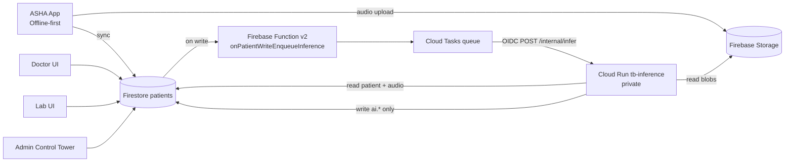

# MedGemma TB Triage Platform

AI-assisted TB screening and triage for ASHA-centered field workflows, with real-model inference, offline-first operation, and role-based care coordination across ASHA, Doctor, Lab, and Admin (Control Tower).

## Live Demo
- Frontend (public): `https://tb-frontend-7z7c3myqlq-uk.a.run.app`
- Backend inference service: private Cloud Run (`tb-inference`) invoked through Cloud Tasks + OIDC.

## Reviewer Accounts (Competition Demo)
Use these accounts for role-based evaluation.  
Password for all accounts: `password123`

| Role | Email | Purpose |
|---|---|---|
| ASHA | `sunita.asha@indiatb.gov` | Field screening + offline collection |
| Doctor | `aditi.doctor@indiatb.gov` | Clinical review + queue prioritization |
| Lab | `rohan.lab@indiatb.gov` | Lab queue, sample processing order, report upload |
| Admin (Control Tower) | `suresh.sts@indiatb.gov` | District/TU monitoring, operations, analytics |

Use `/login` and sign in with one account at a time.

---

<details open>
<summary><strong>0) Judge Walkthrough (5-8 Minutes)</strong></summary>

### What judges should know first
- This is an offline-first TB triage stack: ASHA can collect data offline, backend inference runs asynchronously, and dashboards update from Firestore.
- Real AI outputs are written under `ai.*` fields only.
- First inference after idle can be slower (cold start + heavy model load); subsequent requests are faster.

### Simple real-world workflow (India context)
- Internet is often unreliable in the field, so ASHA workers collect data/audio offline first.
- Many patients delay testing because going to labs means long waits and loss of daily wages.
- Lab capacity is limited, so "first-come-first-served" is unsafe for TB triage.
- This system ranks risk so higher-priority cases move earlier in lab workflow.
- Doctor review is selective and targeted: not every case needs manual doctor intervention before lab actions.
- Admin/STS view tracks queue pressure and facility-level bottlenecks.

### Quick demo sequence
1. Open the live app: `https://tb-frontend-7z7c3myqlq-uk.a.run.app`
2. Login as ASHA: `sunita.asha@indiatb.gov` / `password123`
3. Create one screening (or open existing high-risk patients in ASHA dashboard).
4. Wait for backend processing (typically seconds to a few minutes; cold start can be longer).
5. Logout and login as Lab: `rohan.lab@indiatb.gov` / `password123`
6. Show lab queue ordering by urgency/risk and upload a lab report for one case.
7. Logout and login as Doctor: `aditi.doctor@indiatb.gov` / `password123`
8. Show ranked queue, risk score, and AI summary on doctor side.
9. Logout and login as Admin: `suresh.sts@indiatb.gov` / `password123`
10. Show Control Tower analytics, risk distribution, and facility-level operations.

### Optional validation checks (for judges)
- Confirm AI bilingual summary fields exist: `ai.medgemini_summary_en`, `ai.medgemini_summary_hi`.
- Confirm workflow status progression and role-based visibility.
- Confirm no non-AI fields are overwritten by inference.

### Role switch tip
- Use one role at a time in the same browser session.
- If role routing appears cached, logout and sign in again (or open a private window for each role).

</details>

<details open>
<summary><strong>1) Problem Statement</strong></summary>

Rural TB case finding faces operational gaps:
- Symptom capture is done in low-connectivity settings.
- Risk ranking is inconsistent and often manual.
- Lab infrastructure is constrained, so first-come-first-served queues can delay high-risk patients.
- Many workers and patients lose daily wages if they spend long hours traveling/waiting for tests.
- Clinical handoff across ASHA -> Lab -> Doctor is fragmented.
- AI proof-of-concept systems fail when they overwrite clinical records, use dummy outputs, or break under poor network conditions.

This project solves those constraints by:
- keeping ASHA workflows offline-first,
- using deterministic event-driven backend inference,
- routing actionable high-risk cases into prioritized lab workflow,
- enabling targeted doctor intervention where needed instead of forcing doctor approval for every case,
- writing only `ai.*` outputs to preserve clinical data integrity,
- and presenting actionable ranked queues for Doctor and Lab roles.

</details>

<details open>
<summary><strong>2) What Makes This Submission Strong</strong></summary>

### Real AI Pipeline (not mock)
- HEAR acoustic embedding extraction from cough audio.
- Classical risk models for acoustic + clinical risk.
- Calibrated supervisor model for final TB risk probability.
- MedGemma-based bilingual explanation generation (English + Hindi).

### Clinical Data Safety by Design
- Inference writes back only `ai.*` fields.
- No overwrite of demographics, symptoms, vitals, audio metadata, status, or assignment fields.

### Offline-First Field UX
- ASHA app stores patients and pending uploads locally (Dexie/IndexedDB).
- Sync retries when network returns.
- Foreground periodic sync keeps AI status/risk updated for ASHA view.

### Production Cloud Pattern
- Firestore trigger -> Cloud Tasks (idempotent task naming) -> private Cloud Run inference endpoint (OIDC).
- Retries, dedupe, and skip-reason logic prevent duplicate expensive inference calls.

</details>

<details open>
<summary><strong>3) End-to-End Architecture</strong></summary>



### Core Backend Flow
1. Firestore write on `patients/{patientId}`.
2. Trigger checks eligibility (`audio exists`, `triage ready`, `not already successful for same model version`).
3. Eligible records are enqueued to Cloud Tasks with deterministic IDs.
4. Cloud Task calls private Cloud Run `/internal/infer` with OIDC.
5. Inference service reads patient + audio, runs real model stack, writes `ai.*`.

</details>

<details open>
<summary><strong>4) Advanced Methods (Technical)</strong></summary>

### 4.1 Acoustic + Clinical Fusion
- Audio is windowed at 16 kHz and encoded via HEAR serving signature.
- Aggregation features include `mean/std/p25/p50/p75` of embeddings.
- Classical experts produce:
  - acoustic probability (`hear_score` path),
  - clinical probability,
  - then calibrated stacked risk probability (`risk_score`).

### 4.2 MedGemma Clinical Justification
- Prompted for concise 2-sentence outputs.
- Output post-processing removes chain-of-thought artifacts.
- Hindi response must contain Devanagari; fallback templates are applied if needed.
- Both languages are stored:
  - `ai.medgemini_summary_en`
  - `ai.medgemini_summary_hi`
  - `ai.medgemini_summary_i18n = { en, hi }`

### 4.3 Determinism + Idempotency
- Function guard skip reasons include:
  - `no_audio`
  - `not_ready`
  - `already_succeeded_same_version`
  - `ai_only_update`
- Task IDs include patient + target model version + source write token to avoid collisions.

</details>

<details open>
<summary><strong>5) Data Contract and Firestore Safety</strong></summary>

Inference service returns/stores:
- `ai.hear_score`
- `ai.risk_score`
- `ai.risk_level`
- `ai.medgemini_summary_en`
- `ai.medgemini_summary_hi`
- `ai.medgemini_summary_i18n`
- `ai.generated_at`
- `ai.model_version`
- `ai.inference_status`
- `ai.error_message` (failure only)

### Important Contract Rule
Only `ai.*` is written by inference.  
Non-AI fields are preserved (demographics/clinical/audio/status/assignment).

</details>

<details open>
<summary><strong>6) Offline Mode, Sync, and Resilience</strong></summary>

### Offline-First Behavior
- Local DB: Dexie (`patients`, `uploads`).
- ASHA can continue screening and queue uploads while offline.
- Sync engine pushes pending records + files when connectivity returns.

### Multi-Role Live Updates
- Doctor/Lab/Admin dashboards use Firestore live listeners.
- ASHA receives periodic sync refresh while online to pull backend AI updates.

### Retry and Failure Handling
- Cloud Tasks handles backend retries.
- Inference failures are written to `ai.inference_status=FAILED` with `ai.error_message`.
- `report_inference_status.py` provides operational status snapshots.

</details>

<details open>
<summary><strong>7) Alignment with India Program Reality (NTEP/Nikshay-oriented)</strong></summary>

This repository models operational entities and flow similar to India TB programs:
- ASHA-driven first-mile screening and sample collection.
- PHC-level doctor and lab assignment.
- TU/PHC hierarchy tagging (`tu_id`, `facility_id`, `facility_name`).
- `sample_id`, triage statuses, and longitudinal patient event progression.

### Role Mapping
| Platform Role | Real-world counterpart |
|---|---|
| ASHA | Community frontline worker |
| DOCTOR | PHC/clinical reviewer |
| LAB_TECH | Diagnostic lab workflow |
| ADMIN | STS/TU operational command view |

### Integration Readiness Hooks
- Facility tagging and assignee fields support PHC/TU routing.
- Stable patient/sample identifiers can be mapped to external reporting systems.
- AI outputs are additive (`ai.*`), enabling safe downstream interoperability.

### Suggested National-Scale Integration Next Steps
1. Add export connectors for structured reporting feeds.
2. Map patient + sample schema to program reporting templates.
3. Add facility registry synchronization pipeline.
4. Introduce auditable integration adapters for state/district deployments.

</details>

<details open>
<summary><strong>8) Data Sovereignty, Privacy, and Governance</strong></summary>

### Controls in this codebase
- Role-based Firestore access (`firebase/firestore.rules`).
- Role-based Storage path policies (`firebase/storage.rules`).
- No client-side delete for core clinical records.
- Upload scope and MIME/type/size guardrails in rules.

### Sovereignty posture
- For India production, run in India regions and keep all storage/compute in-country.
- This competition deployment currently uses `us-east4`; production rollout should switch to India-region infrastructure.

### Security model
- Private inference service.
- Cloud Tasks OIDC-authenticated calls.
- Server-side Firebase token verification for sync API.

</details>

<details open>
<summary><strong>9) Scalability to Internet-Scale Usage</strong></summary>

Current architecture is horizontally scalable by design:
- Stateless Cloud Run services.
- Queue-buffered asynchronous inference.
- Event-driven fan-out from Firestore writes.

### Scale plan
1. Increase Cloud Run max instances for inference workers.
2. Partition Cloud Tasks queues by geography/priority/model-version.
3. Add autoscaling guardrails by latency + queue depth.
4. Introduce cached model artifacts and warm pools for lower first-hit latency.
5. Add regional deployment topology for data-locality and failover.

### Frontend (demo-tuned Cloud Run)
- `min-instances=1`
- `max-instances=3`
- `concurrency=20`

</details>

<details open>
<summary><strong>10) Cold Start and Latency Disclosure</strong></summary>

Observed from Cloud Run request logs (current deployment):
- Warm inference requests: typically ~2s to ~10s.
- One cold/first-load request observed at ~603s (`2026-02-23T22:54:30Z`) due heavy model initialization.

Why this happens:
- Backend inference is configured for scale-to-zero economics.
- Real HEAR + classical + MedGemma model loading is heavy on first activation.

Mitigation options:
1. Set `min instances > 0` on inference service for demo-critical windows.
2. Pre-warm revisions after deploy.
3. Cache artifacts locally and keep warm model bundles.
4. Reduce first-hit work by staged model warm-up.

</details>

<details open>
<summary><strong>11) Deployment Guide (What Reviewers Need)</strong></summary>

### Backend deploy
See: `backend/cloud-backend/QUICKSTART_WORKBENCH.md`

### Frontend deploy (Cloud Run)
```bash
cd /home/jroot/TB-medgemma
chmod +x frontend/deploy_cloud_run.sh
PROJECT_ID=medgemini-tb-triage \
REGION=us-east4 \
SERVICE_NAME=tb-frontend \
AR_REPO=tb-backend \
NEXT_PUBLIC_API_BASE_URL=/api \
./frontend/deploy_cloud_run.sh
```

### Health checks
```bash
gcloud run services describe tb-frontend --project medgemini-tb-triage --region us-east4
gcloud run services describe tb-inference --project medgemini-tb-triage --region us-east4
```

</details>

<details open>
<summary><strong>12) Repository Structure</strong></summary>

```text
backend/
  main.py                                  # Sync API (token-verified)
  populate_db.py                           # NTEP-style seeded demo data
  cloud-backend/
    inference-service/                     # FastAPI inference worker (Cloud Run)
    functions/                             # Firestore -> Cloud Tasks trigger (v2)
    deploy_workbench.sh                    # one-command backend deploy
    report_inference_status.py             # status snapshot utility

frontend/
  app/                                     # role-based Next.js views
  components/                              # dashboards, queues, profiles
  lib/                                     # offline DB, sync engine, AI score normalization
  deploy_cloud_run.sh                      # frontend deploy script
```

</details>

<details open>
<summary><strong>13) Model Training Provenance (CODA-TB + Kaggle)</strong></summary>

Training artifacts and notebook history are tracked in:
- `research/model-training-notebooks/README.md`
- `research/model-training-notebooks/V10_FINAL_BLOCK_AND_RESULTS.md`

This folder includes:
- raw trial-and-error notebooks,
- final V10 training summary,
- reported fold metrics,
- deployment artifact manifest,
- CODA-TB/HeAR input-length limitation notes and mitigation strategy.

### Reported V10 fold performance
- Fold AUCs: `0.8364, 0.8297, 0.7926, 0.7877, 0.7427`
- Fold pAUC@90%: `0.9681, 0.9682, 0.9815, 0.9619, 0.9480`
- Mean AUC: `0.7978`
- Mean pAUC@90%: `0.9655`

### CODA-TB constraint acknowledged
HeAR requires fixed 2-second windows, but CODA cough clips are variable length and frequently shorter than this requirement.  
Our training pipeline handled this with mirror+tile padding, overlapping multi-window extraction, and participant-level embedding aggregation.

</details>

<details open>
<summary><strong>14) References (Program + Policy Context)</strong></summary>

- WHO: Tuberculosis fact sheet and global burden updates  
  https://www.who.int/news-room/fact-sheets/detail/tuberculosis

- WHO Global TB Report 2024  
  https://www.who.int/teams/global-tuberculosis-programme/tb-reports/global-tuberculosis-report-2024

- NTEP knowledge portal  
  https://tbcindia.mohfw.gov.in/

- Ni-kshay platform (program ecosystem)  
  https://www.nikshay.in/

- National Strategic Plan for TB Elimination 2017-2025 (India)  
  https://tbcindia.mohfw.gov.in/WriteReadData/NSP%20Draft%2020.02.2017%201.pdf

- Ayushman Bharat Digital Mission (ABDM)  
  https://abdm.gov.in/

- MeitY digital data protection framework resources  
  https://www.meity.gov.in/data-protection-framework

</details>

---

## Competition Note
This submission is intentionally built around production constraints:
- real model inference,
- offline-first last-mile collection,
- deterministic and secure cloud orchestration,
- and India-aligned operational workflow semantics.

No dummy AI summaries/actions are used in the current pipeline.
